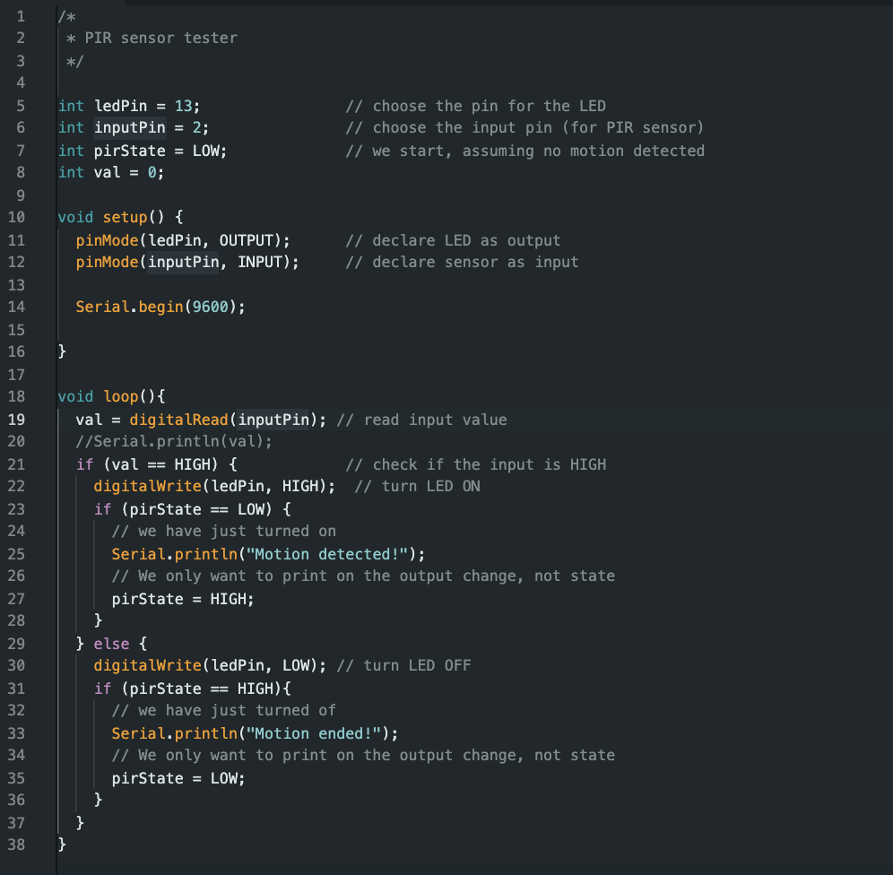

# Smile Recognition with Python

Bringing smiles to life through an program coded with OpenCV and Python! Using two Haar Cascades, one for smiles and the other for frontal face detection, this project combines a variety of skils to make an IoT smile detection device. With the rasberry pi and pi cam, you can create a handheld device with a CAD case to detect smiles instead of using your computer camera!

| **Engineer** | **School** | **Areas of Interest** | **Grade** |
|:--:|:--:|:--:|:--:|
| Audrey Z | Lynbrook High School | Electrical Engineering | Incoming Sophomore


# Final Milestone
<iframe width="560" height="315" src="https://www.youtube.com/embed/hGSi-kFk8uw" title="YouTube video player" frameborder="0" allow="accelerometer; autoplay; clipboard-write; encrypted-media; gyroscope; picture-in-picture; web-share" allowfullscreen></iframe>

The first decision I made for my third milestone was just to focus on making an iot device from the code that I already had and not adding a smiling eye detection program to it because I had to make my own Haarcascade and I didnt have the proper resources for that. There were three different ways you could make a Haarcascade, downloading sample images off of the internet, using a webcam to take pictures myself, or going on imageNet and then finding negatie objects as well and then training it. I didn't have a camera, and image net wasnt working. I also downloaded an extention to download images off of the internet but because of all the copyrighted images it didnt give me the best results and the pictures were not useful to my target object. 

I got my Raspberry Pi and then becuase my computer didn't have a monitor I downloaded OBS. After this I downloaded VScode and transferred my code to my monitor instead of the VScode app on my desktop. After that I downloaded opencv and numpy. This is where I ran into one of the biggest errors in this project. Opencv took 1.5-2 hours to download and I kept running into errors like there wasn't the wheels or a pep 517 error. This happened becuase the version of OpenCV I was trying to downoad wasnt compatable with my version of python, and the wifi was also making it very slow. It took about 7-8 tries and failed downloads to finally get it downloaded after I updated all my software. After this, I connected my pi camera to my raspberry pi and got it connected to my computer through the command line. The last step was altering my code to actually call the pi camera instead of the one already on my desktop. My next step is to work on my CAD design case for my raspberry pi and install an led onto my raspberry pi so that it will light up when the smile is detected. 


# Second Milestone
<iframe width="560" height="315" src="https://www.youtube.com/embed/Uia_CRZ00F8" title="YouTube video player" frameborder="0" allow="accelerometer; autoplay; clipboard-write; encrypted-media; gyroscope; picture-in-picture; web-share" allowfullscreen></iframe>

For my second milestone I added a new message for not smiling text and made them red and green for when you are smiling or when you aren't. I also finished my eye detention program that's separate. I also finished coding my eye detction program. The second time it was a lot simpler to code eye detection because it was a lot of the same things, for example cropping down the face and converting it to grayscale. However it was interesting to figure out the dimensions for eyes because it took a lot of trial and error to find the right placement of the eye squares on the interface. Later in the demo you will see that there is the same square around the face and this time there are also two squares around the eyes that show that the program is working and it knows where your eyes are. This time I also used an eye cascade and  a face cascade like I did for my smile detection. 

Next I would like to learn how to make my own cascade and train it to recognize smiling eyes and then connect that with my original program to make it more accurate to see if you are truly smiling or not and in the future some possible modifications include connecting the program to a handheld device integrating an Arduino and Led. Overall I learned alot in this milestone and gained deeper understainding about how image and object detection works becuase I had to essentially recreate my first program but the target object was eyes. 


# First Milestone
<iframe width="560" height="315" src="https://www.youtube.com/embed/8-t_CaiJ4nM" title="YouTube video player" frameborder="0" allow="accelerometer; autoplay; clipboard-write; encrypted-media; gyroscope; picture-in-picture; web-share" allowfullscreen></iframe>

My project is the smile recognition with Python and openCV. This program uses two haarcascades, one to recognize the users face and the other one to recognize if the user is similing or not. These Haarcascades are made up with large amouts of data to pre-train the program. The program crops the users face down to the dimentions like that in the haarcascades and then coverts it into greyscale to again, be similar to the examples. One of the things that took me the longest time to resolve was trying to figure out what to dowlonad. I needed numpy and opencv for this program but and to download an intaller first. The internet told me to download pip but it wasnt compatable with my computer so I ended up dowloading homebrew. After this I had to dowload the newest version of python becuase they still weren't compatable with my computer. In the end, I got my program working. 

Next I would like to make it more efficient and clear to the user whether they are smiling or not. For example as of now it only shows text if you are smiling, I would like to add a not smiling text in red while the smiling text is green. Additionally I would like to play around with the certain values to see if I can get it to be more accurate. In the future I would also like to add some way to use eyes to make it more accurate. For example a real smile is when your eyes also crinkle. I think it would be a cool idea to also input that into the program. 


<!-- # Schematics 
Here's where you'll put images of your schematics. [Tinkercad](https://www.tinkercad.com/blog/official-guide-to-tinkercad-circuits) and [Fritzing](https://fritzing.org/learning/) are both great resoruces to create professional schematic diagrams, though BSE recommends Tinkercad becuase it can be done easily and for free in the browser. 

 # Code
Here's where you'll put your code. The syntax below places it into a block of code. Follow the guide [here]([url](https://www.markdownguide.org/extended-syntax/)) to learn how to customize it to your project needs. 

```c++
void setup() {
  // put your setup code here, to run once:
  Serial.begin(9600);
  Serial.println("Hello World!");
}

void loop() {
  // put your main code here, to run repeatedly:

}
```
-->
# Starter Project
<iframe width="560" height="315" src="https://www.youtube.com/embed/FgX3ZWk1tlU" title="YouTube video player" frameborder="0" allow="accelerometer; autoplay; clipboard-write; encrypted-media; gyroscope; picture-in-picture; web-share" allowfullscreen></iframe>

My starter project was the custom arduino project, where you can add your own input and output. My input was the PIR Motion Sensor and my output was the LED. First I wired up the arduino to the sensor and then uploaded the code. The program first identifies the input, and led pins and then contsntly detects if there is motion infront of the sensor. then it will light up the led accordingly and print a "Motion Detected", "Motion ended" on the serial moniter. After I got all parts to work I soldered on the proto shield and capacitors, restrictors,leds, and buttons, and then replicated the wiring on the proto shield. Overall this project was a fun wiring and soldering project and I had fun. 




# Additional Info
A cascade is  a large data library with thousands of samples and it pre trains the program to recognize those things. All examples are cropped to a certain size and also converted into grayscale. The program recognizes the positives as the target and the negatives as things that are not what we want to detect. Through this milestone I also learned a lot about the functions of haarcascades and how to make them, as well as ways you can use them and how to use them in a program. I also did some research on how OpenCV is integrated in the whole thing. OpenCV takes the face and the example that is grayscale and cropped town to a certain size and then converts it into one big array with rgb values.  
# Bill of Materials

| **Part** | **Note** | **Price** | **Link** |
|:--:|:--:|:--:|:--:|
| Rasberry Pi 4 Kit | Making Iot Device | $124.95 | <a href="https://www.pishop.us/product/raspberry-pi-4b-starter-kit-pro/"> Link </a> |
|:--:|:--:|:--:|:--:|
| Pi Cam Module 3 | Camera for Program | $25.00 | <a href="https://www.pishop.us/product/raspberry-pi-camera-module-3/"> Link </a> |
|:--:|:--:|:--:|:--:|
| Led | Show if the user is smiling or not | $7.59 | <a href="https://www.amazon.com/eBoot-Pieces-Emitting-Diodes-Assorted/dp/B06XPV4CSH/ref=asc_df_B06XPV4CSH/?tag=hyprod-20&linkCode=df0&hvadid=167146990738&hvpos=&hvnetw=g&hvrand=10448453497776440873&hvpone=&hvptwo=&hvqmt=&hvdev=c&hvdvcmdl=&hvlocint=&hvlocphy=9032131&hvtargid=pla-369941417757&psc=1"> Link </a> |
|:--:|:--:|:--:|:--:|
| 330 Ohm Resistor | Wiring for the Led | $0.11 | <a href="https://www.mouser.com/ProductDetail/YAGEO/CFR-50JR-52-330Rqs=19cKSROHwrCn5mlDH3KUrg%3D%3D&mgh=1&gclid=CjwKCAjw44mlBhAQEiwAqP3eVizGlnXLQSKes5sTsiRPi_mnYsQ8tNg0DEcXeo22xNhL4FCYS8fCeBoCPtcQAvD_BwE"> Link </a> |
|:--:|:--:|:--:|:--:|

<!-- # Other Resources/Examples
One of the best parts about Github is that you can view how other people set up their own work. Here are some past BSE portfolios that are awesome examples. You can view how they set up their portfolio, and you can view their index.md files to understand how they implemented different portfolio components.
- [Example 1](https://trashytuber.github.io/YimingJiaBlueStamp/)
- [Example 2](https://sviatil0.github.io/Sviatoslav_BSE/)
- [Example 3](https://arneshkumar.github.io/arneshbluestamp/)

To watch the BSE tutorial on how to create a portfolio, click here. 
--> 
